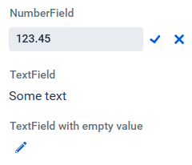

[](https://vaadin.com/directory/component/editable-labels-for-vaadin)
[](https://mvnrepository.com/artifact/software.xdev/vaadin-editable-label)
[](https://github.com/xdev-software/vaadin-editable-label/actions/workflows/check-build.yml?query=branch%3Adevelop)
[](https://sonarcloud.io/dashboard?id=xdev-software_vaadin-editable-label)


# Editable Labels for Vaadin
A Vaadin Flow implementation for editable labels



This component provides a couple of elements that are displayed as simple read-only components, but can be edited with a
simple click.
Following components are available:

* [EditableLabelTextField](./vaadin-editable-label/src/main/java/software/xdev/vaadin/editable_label/predefined/EditableLabelTextField.java)
* [EditableLabelTextArea](./vaadin-editable-label/src/main/java/software/xdev/vaadin/editable_label/predefined/EditableLabelTextArea.java)
* [EditableLabelComboBox](./vaadin-editable-label/src/main/java/software/xdev/vaadin/editable_label/predefined/EditableLabelComboBox.java)
* [EditableLabelDatePicker](./vaadin-editable-label/src/main/java/software/xdev/vaadin/editable_label/predefined/EditableLabelDatePicker.java)
* [EditableLabelNumberField](./vaadin-editable-label/src/main/java/software/xdev/vaadin/editable_label/predefined/EditableLabelNumberField.java)
* [EditableLabelBigDecimalField](./vaadin-editable-label/src/main/java/software/xdev/vaadin/editable_label/predefined/EditableLabelBigDecimalField.java)

It's also possible to create a custom element:

```java 
final EditableLabel<EmailField, String> emailLabel = new EditableLabel<>(new EmailField()).withValue(defaultValue);
```

## Installation
[Installation guide for the latest release](https://github.com/xdev-software/vaadin-editable-label/releases/latest#Installation)

#### Compatibility with Vaadin
| Vaadin version | Editable label version |
| --- | --- |
| Vaadin 24+ (latest) | ``2+`` |
| Vaadin 23 | ``1.x`` |

### Spring-Boot
* You may have to include ``software/xdev`` inside [``vaadin.allowed-packages``](https://vaadin.com/docs/latest/integrations/spring/configuration#configure-the-scanning-of-packages)

## Run the Demo
* Checkout the repo
* Run ``mvn install && mvn -f vaadin-editable-label-demo spring-boot:run``
* Open http://localhost:8080

<details>
  <summary>Show example</summary>
  
  
</details>

## Support
If you need support as soon as possible and you can't wait for any pull request, feel free to use [our support](https://xdev.software/en/services/support).

## Contributing
See the [contributing guide](./CONTRIBUTING.md) for detailed instructions on how to get started with our project.

## Dependencies and Licenses
View the [license of the current project](LICENSE) or the [summary including all dependencies](https://xdev-software.github.io/vaadin-editable-label/dependencies)
